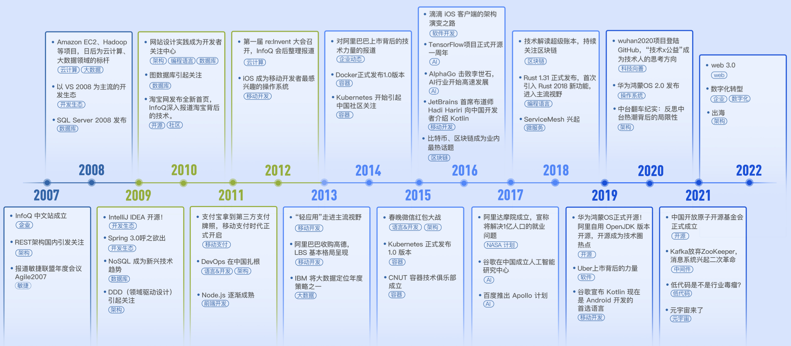
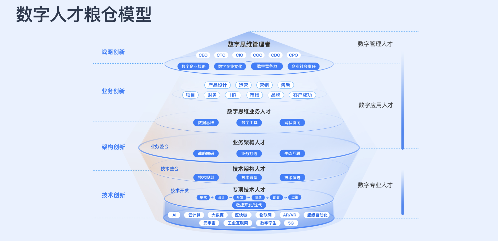
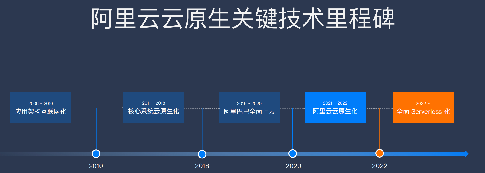
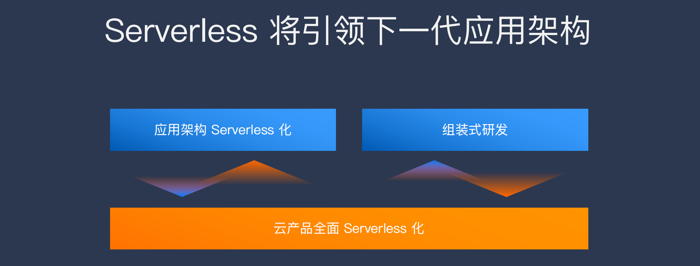
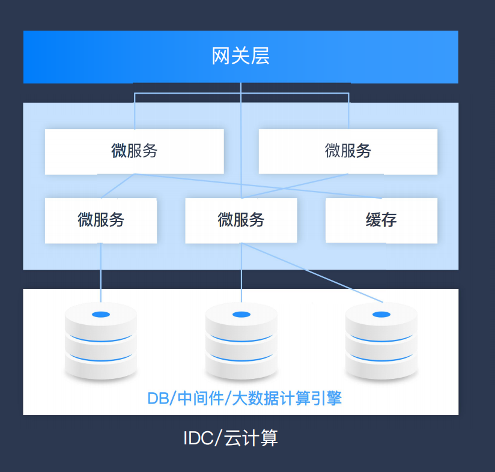
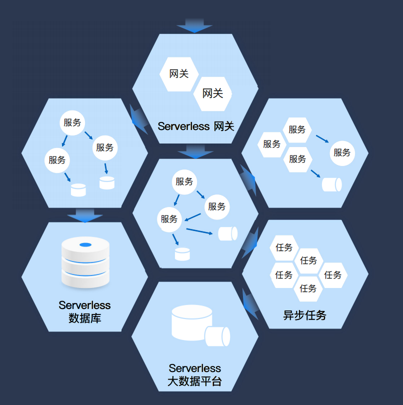
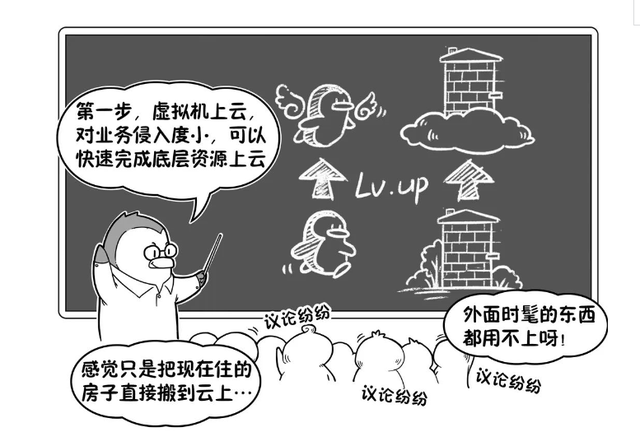
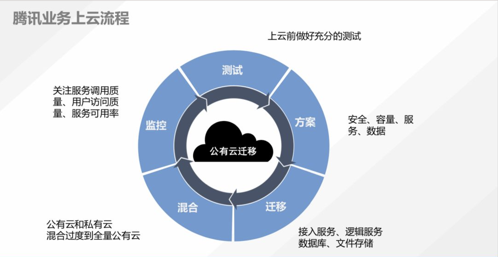

## 2022Qcon上海

##### 从见证者到推动者，InfoQ中国的 15 年 & 软件正在重新定义世界

2022年InfoQ-slogan 由 ***软件正在改变世界***  替换为 ***软件正在重新定义世界***

2007-2010 以对外文的翻译和模仿为主

2011-2015 DevOps中国快速落地 到 *Kubemetes1.0版本发布*

2016-2020 AlphaGo兴起奠定AI的发展

2021-至今 元宇宙元年

​        极客邦科技双数研究院联合各行各业的生态伙伴，共同发布《数字人才发展体系：粮仓模型白皮书》，分享在数字经济方面的观察以及在数字人才发展与培养方面的研究和发现，以期帮助企业更好地走上自己的数字化转型之路，作为开发人员重点关注第四层和第五层，

##### 第四层：技术架构人才

通常来讲，IT 架构包括应用架构、数据架构和技术架构。通常技术架构人才是技术侧稀缺的横向复合型人才，横跨多个技术领域，具有技术侧的全局思维。这部分人也是靠培训加实干，靠大量项目经验的堆积才能养成的，其能力核心集中在技术规划、技术选型以及技术演进上。

##### 第五层：专项技术人才

这部分人才需要具备两类能力。一类是软件工程能力，知道开发体系怎么运转。开发工作在企业里都是团队作战，通常说软件工程，主要指包含需求、设计、开发、测试、部署、运维的传统瀑布式开发，或者是敏捷开发迭代的模式，不过很多企业在引入敏捷后，逐步发展成混合模式了。另一类是专项技术能力，包括人工智能、区块链、大数据等。这两部分叠加起来是专项技术人才需要持续学习提升的部分。

​       此模型也强调四大创新，包括战略创新、业务创新、架构创新和技术创新，这四个创新也是和企业数字化转型的路径相呼应的，完成“数字化转型路径四部曲”，即从战略转型到架构转型，再到技术转型，最后到业务转型。[《数字人才发展体系：粮仓模型白皮书》](https://www.infoq.cn/article/wHR5Qxi11hHw0ZG8fRsc)

### 1.从上云到用云，Serverless 引领下一代应用架构

嘉宾：丁宇（叔同） 阿里巴巴 /研究员，阿里云智能云原生应用平台总经理

​        负责阿里云容器服务、应用 PaaS、中间件、Serverless 等产品线，服务数十万行业客户。十次参与阿里双 11，构建了互联网分布式高可用技术体系。负责阿里容器基础设施，推动统一调度、混合部署、云原生上云等阿里几代技术架构演进。带领团队打造了多款云原生开源项目：Dubbo、RocketMQ、KubeVela、OpenYurt、Nacos、Seata、Sentinel、Higress、Koordinator 等，赋能百万开发者使用开放标准先进的云原生技术。

#### “阿里巴巴”的云原生时间轴

**阶段一：**阿里巴巴通过核心系统云原生化为契机，于2020年完成全部上云工作。

**阶段二：**2021-2022年实现阿里云云原生化落地

**阶段三：**2022年开始全面Servless化

Serverless 将“部署”这个动作从运维中“收走”，使开发者不用关心应用在哪里运行，更不用关心装什么OS、怎么配置网络、需要多少CPU……从架构抽象上看，当业务流量到来/业务事件发生时，云会启动或调度一个已启动的业务进程进行处理，处理完成后云自动会关闭/调度业务进程，等待下一次触发，也就是把应用的整个运行时都委托给云。

    

​                                                        **联网分布式应用架**                                                                    **Serverless 架构**

#### 阿里巴巴云原生Serverless特点：

1. 全面托管：从半托管到全托管做的更少而收获更多

2. 自适应弹性：全链路自动伸缩从容应对流量波动

3. 开箱即用：企业不需要繁琐的运维易于集成和使用

4. 按用量付费：不为闲置资源付费成本更优

   

   开源生态极大丰富，带来巨大学习成本

   

### 2.腾讯自研业务全量云原生改造带来的技术启示（远程）

沙开波 腾讯云 /副总裁

**2022年6月16日，腾讯宣布“搬家了”——集团内部自研业务已实现全面上云。**腾讯 2018 年启动整体战略升级，并成立技术委员会，明确“开源协同”和“自研上云”两大技术战略。其中，自研上云主要是将腾讯集团内部的海量自研业务包括社交、游戏、内容等业务搬上云端。

#### 腾讯自有业务上“腾讯云“的价值

- **第一是业务价值，业务的研发效率更高**，从0到1开发一个新产品短短一周就能完成，微服务框架、数据库、容器资源、持续集成、持续交付、统一配置中心等等，云上都有现成的服务，研发团队不需要到处拼装各种组件和工具，可以更专注业务研发。

- **第二是工程师价值**，工程师可以使用到整个业界最标准化的服务，基于公有云的研发模式，能够离开封闭的开发环境和组件，同时工程师还可以输出非常优秀的组件到云上成为服务，这也是大多数工程师的梦想。

- **第三是客户价值**，可以给行业输出非常多的公有云的经验。截至2019年初，腾讯正式发布的对外开源项目将近70个，诸如[腾讯云](https://l.gushuji.site/tencent)T stack、蓝鲸智云BlueKing CMDB、微信开源系列和TARS等，都是腾讯开源的典型案例。

  

#### 腾讯自研业务上“腾讯云“的程度

##### 上虚拟机是否等于上云

> 虚拟机上的节点坏了，因为虚拟机不具备节点直接迁移的属性，所以需要运维人员人工给节点在两台虚拟机之间做转移。但如果节点是部署在K8S的平台上，系统可以代替人工来给节点做自动调度。
>
> 由于K8S具备更全面的虚拟化支持，在整个研发体系完成上云之后，节点部署与虚拟机脱离，开发过程中CI/CD（持续集成/持续部署）流程作为流水线般的自动交付过程可以更完整的实现，这可以被理解成一种“自愈”能力。

##### 运行稳定是否就是技术最优

> QQ和微信等自建 PaaS长期稳定运行，是否一定要用最新技术去替换和迭代。腾讯云上的所有服务只有通过内部率先使用、检验，经历腾讯内部真正的海量业务打磨，才真正具备更好的推动产业上云的能力，这是腾讯自研上云背后所传递的核心理念之一。

#### 腾讯自研业务容器化上云的技术路线经历阶段

- 一个虚拟机只调度一个容器的上云实验阶段，我们叫胖容器阶段；

- 一个节点多个 Pod，Pod 中有多进程的阶段；

- 然后是单 Pod 单进程的微服务容器阶段；

- 现在在腾讯内部也有大规模的容器使用 TKE Serverless，为业务提供 FaaS 的能力

整个阶段都在夯实混部技术，包括离线混部、在线业务混部。Service Mesh 也得到了一定规模的实践。

#### 腾讯自研上云涉及的相关产品的简单架构

最底层是 IaaS 腾讯云计算网络存储，往上层的基础服务主要是 Kubernetes、ETCD、Helm，再往上是腾讯云的产品化服务，包括腾讯 TKE 产品、TKE Serverless、Edge、TKE-STACK。TKEx 容器平台服务腾讯内部业务，内部入口可以直接是容器平台或者研效平台。

#### 业务团队在上云的过程中所做的流程

- **第一是测试**，包括公有云上的网络、存储、虚拟机、核心服务，以及单机性能、服务吞吐性能、存储读写性能、业务模块性能等等都经过测试。通过测试之后，我们和云团队一起优化了服务性能，对业务也相应做了改造适配。
- **第二是业务上云方案**，包括安全方案、容量评估、服务迁移方案和数据迁移方案等。
- **第三是业务迁移**，迁移包括接入层、逻辑层、数据层及文件存储等的迁移。
- **第四是混合云共存**，业务会逐渐灰度迁移到云上，比如在线用户从5%、10%、20%、30%到100%等，是一个灰度迁移过程。在灰度过程中可以及早发现各种问题，逐一解决，避免大规模上量时出现灾难性后果。这个过程中就存在公有云和私有云的混合部署模式，就要重点关注专线使用容量，做好专线在业务高峰期的预案，以及业务跨混合云访问的服务延迟，及时做好用户在不同云之间调度的策略和方法。
- **最后是业务监控**。上了云之后使用立体化的监控体系，度量服务调用质量、用户访问质量和服务可用率等，譬如跟踪用户在私有云和公有云的访问延迟有没有变差，不能变坏，运营质量有没有跟原来保持一致，甚至变得更好。

**从测试、方案、迁移、混合到监控，所实施的上云迁移整体流程。**

#### 云原生的设计理念

- 面向分布式设计（Distribution）：容器、微服务、API 驱动的开发；
- 面向配置设计（Configuration）：一个镜像，多个环境配置；
- 面向韧性设计（Resistancy）：故障容忍和自愈；
- 面向弹性设计（Elasticity）：弹性扩展和对环境变化（负载）做出响应；
- 面向交付设计（Delivery）：自动拉起，缩短交付时间；
- 面向性能设计（Performance）：响应式，并发和资源高效利用；
- 面向自动化设计（Automation）：自动化的 DevOps；
- 面向诊断性设计（Diagnosability）：集群级别的日志、metric 和追踪；
- 面向安全性设计（Security）：安全端点、API Gateway、端到端加密；

以上的设计理念很多都是继承自分布式应用的设计理念。

#### 3.OPPO 移动研发平台建设实践

刘志保 OPPO /移动研发平台负责人

曾先后就职于一加、OPPO，长期从事移动架构设计、跨平台中间件研发工作。

**一站式移动应用开发场景下的端云协同：**

目前业界一站式开发平台"百家争鸣"，对其定位各有不同，不同平台解决需求的场景和规模也各有千秋，往往让人觉得平台强大但是不知道如何选择，总在完成平台选型后发现和实际开发场景下的需求存在一定偏差。本次分享便从 OPPO 实际碰到的场景出发抽丝剥茧进行 OPPO 最佳实践的解析，并介绍整体开发平台的演进史、解读平台的每个功能模块。

**演讲提纲：**

1.移动研发平台定义和现状(全生命周期覆盖、关键技术)；

2.OPPO 移动研发碰到的痛点（如 SDK 重复建设、SDK 方案选型难、SDK 依赖冲突、升级发布难）和平台介绍；

3.OPPO 移动研发平台整体建设情况和历程(如 SDK 能力建设、SDK 市场建设、一站式平台建设、XR 探索)；

4.未来规划(如对外开放、商业化之路；

**你将获得：**

1.了解 OPPO 如何基于自身发展构建移动开发平台；
2.了解 OPPO 移动开发平台的演进历程与实践。

#### 4.从故障驱动走向 SLO 驱动的稳定性建设实践

丁乾 蚂蚁集团 /高级技术专家

1. 本次分享围绕蚂蚁基础设施 SRE 团队在云原生架构的演进过程中的的稳定性建设，复盘真实的生产故障案例，探讨在云原生的时代的技术风险防控策略。针对 SRE 的经典方法论之一的 SLO 体系，对于其在云原生场景的构建、扩展和运营，将结合真实的使用场景，剖析难点和挑战，并给出具备可操作性的解决路径。

   **演讲提纲：**

   1. 引论

   - 真实故障场景分享
   - 回顾经典的技术风险防控体系建设
     - 事前/事中/事后

   2. 云原生场景下的稳定性建设的特征分析

   - 分布式系统的大量使用和业务增长带来的问题
   - 云厂商/云服务的使用对底层基础设施的冲击

   3. SLO 驱动的技术风险防控体系

   - 经典概念对齐以及扩展概念引入
   - 结合真实故障的使用案例分享 SLO 数据建设
   - SLO 运营思路和潜在误区
     - 实践并验证过的有效运营手段分享，例如预警、定位、大盘等
     - 公示、文档等强运营流程在稳定性建设中的作用
     - 误区：不要把 SLO 当作传统监控使用

   4. 总结展望：SLO 使用的三个阶段

   **你将获得：**

   - 了解 SLO 驱动的稳定性建设的使用场景以及其对应的优势
   - 了解 SLO 体系构建过程中的困难挑战以及对应的解决思路
   - 了解云原生场景下的稳定性建设的可行思路和优化手段

#### 5.银行系统用户中心的稳定性建设实践

田垅 平安银行 /高级研发经理

用户中心作为金融系统业务流量的入口，对稳定性和可用性有着极其挑剔的要求，作者通过对流程和规范的治理、架构治理、架构优化等手段大幅度提高了系统的可用性和稳定性，整个过程既有实战落地方案也有指导理论思想，对大多数业务系统的稳定性建设有很好的参考价值。

#### 6.国泰君安新一代低延时交易平台

叶飞 国泰君安 /证券数据中心系统运行分析员

#### 7.图计算在软件安全开发生命周期中的创新应用与实践

盛锦辰 支付宝 /业务风险技术部安全专家、业务安全架构师

金融科技在发展的同时也面临诸多挑战，包括网络安全风险、应用代码安全风险、供应链软件安全风险在内的科技风险治理就是一个需要重点攻关的课题。

大多数金融科技企业都已根据自身情况初步建立了软件安全研发生命周期流程体系（SDL/DevSecOps），以期通过研发过程中识别和消除大部分安全风险。如何全方位、系统化的高效识别研发流程中的各类安全风险，提升安全研发管控流程的数字化水平，整个行业都在探索技术方案上的创新和突破。

复杂的支付业务场景往往具有较长的逻辑链路，传统安全工具难以进行自动化理解和风险全面扫描识别。安全风险的发现和处置非常倚赖研发工程师、安全工程师的意识、经验和人力投入，风险覆盖度无法系统性保障，安全生产效率也难以提升。在落地SDL体系的过程中，我们曾被这个问题长期困扰。最终我们引入图计算等技术手段，升级构建了一套新的安全研发流程平台与工具体系，较好的解决了这个难题。

在新的工具体系中，我们使用动静态程序分析技术对单个应用进行了完整地业务抽象建模，设计了以业务场景风险数据为主体的图数据库，构建代码调用链路图和数据流转链路图对业务逻辑进行准确刻画。在此基础上，我们将安全专家的经验和已有安全漏洞案例抽象为图数据库的风险查询规则，专家的经验转化为图数据库计算能力，实现了工程师与自动化工具的高效协同。

我们正在支付宝实践与落地这套平台与工具体系，并以此为基础构建了核心安全风险指标体系，形成较为全面的安全风险图谱，全面提升了科技风险识别能力和处置水平。

**演讲提纲：**

1. 安全研发生命周期体系的技术挑战和痛点

2. 破局：构建图计算驱动的新一代安全研发工具体系

- 基于程序分析技术的业务抽象建模
- 构建业务场景风险数据为主体的图数据库
- 构建高效、高精度跨应用时序链路的探索能力

3. 实战应用案例

- 基于可视化链路的场景识别与风险评估过程
- 基于数据流转链路的内容安全风险识别

4. 安全研发体系的未来

**你将获得：**

- 在复杂组织中落地软件安全研发流程体系的实践经验
- 如何结合程序分析、图数据库技术实际解决安全风险评估痛点问题的实践经验

#### 8.金融科技安全领域的数据资产体系建设实践

陈朝钢（摩净） 蚂蚁集团 /高级数据技术专家

数字化金融科技面临账号安全、欺诈、洗钱、网络安全等各安全领域挑战，在与黑灰产的持续对抗过程中，我们沉淀了近百万张离线数据表、万亿级实时流式数据及经过批\实时\图计算之后产生的数十万个特征，这些数据资产的覆盖度、可靠性、时效性直接影响到我们的安全对抗水位。与此同时数据安全、个人隐私保护等监管要求也趋严，如何保障数据合规及个人隐私数据不泄露不滥用也是一项极具挑战的工作，本次分享希望就以上话题跟大家深入交流。

**演讲提纲：**

1. 业务背景介绍

- 金融安全风险简介
- 安全大数据整体架构

2. 数据资产建设实践

- 建模策略与方法
- 精品数据资产建设
- 提升海量数据检索时效性
- 应对计存成本暴涨问题
- 个人隐私保护

3. 未来展望

**你将获得：**

- 了解金融安全风险对抗的新趋势及数据整体架构原理
- 百 PB 级海量数据资产建设方法论与经验总结           
- 智能数据治理和海量数据快速检索经验            

#### 9.提升 ROI，在“降本增效”的大背景下解决性能守护者的痛点

在“降本增效”的大背景下，各个业务线都在成本收缩，但性能质量又是一个不容忽视的红线问题，如何轻量化的发现性能问题根因、低成本的找到头部性能问题是业务的重要痛点，本次演讲将给大家分享一些思考和对策。

**演讲提纲：**
业务痛点：

- 客户投诉的性能问题能否快速找到问题原因，并立即解决？
- 性能问题这么多，人员不足是常态，能不能准确找到关键的头部问题？
- 在“降本增效”的形势下，如何通过低成本、轻量化的性能监控助力业务成功？

解决方案：

1. 轻量化的发现问题根因

- 历史经验沉淀及自动化分析
- 找到引发问题的人是最关键的 
- 利用研发环境反哺线上问题

提出问题：如何判断这个研发环境的问题就是线上的问题？如果判断这个问题的严重程度？

2. 低成本的找到头部问题

- 如何低成本的获取更多的有效数据是基础
- 如何提取问题的关键特征最重要
- 如何利用大数据来修正偏差是优势
- 如何与研发流程内的数据融合是目标

3. 再进一步 

- 线下和线上的联系能够更紧密
- 到底要多像才能算成同一个问题 

**你将获得：**

- 轻量化发现性能问题根因的方法
- 低成本大数据量性能分析的思路
- 线上线下数据融合的理念

#### 10.短视频风控算法实践

fled 字节跳动 /抖音风控 算法负责人

抖音作为字节中国区最大的流量入口，也是黑灰产作弊的重点对象，因此面临多种多样的风险问题，且因为作弊手法差异比较大，大部分问题都有特异性，同时风险的点位也比较多，所以整体防控上面临不少的技术难点。在本次论坛中，我们会和大家分享在治理抖音黑灰产过程中，如何利用技术手段识别出平台上违规内容和违规用户，并从从事前，事中，事后三个方面来制定整体的管控方案。

**演讲提纲：**

1. 平台常面临的风险与解决难点
2. 防控体系与算法能力 

- 风险感知 
- 快速召回 
- 分层处置 
- 自动对抗 

3. 下一步的演进方向

**你将获得：**

- 怎样综合利用计算机视觉、自然语言处理、图、低资源学习等 AI 技术识别风险问题
- 如何针对内容平台常见风险设计一整套的防御体系

#### 11.华为 API 治理的方法与实践

曹菲 华为 /IT 平台服务部 API 运营及治理负责人、主任工程师

华为从 2016 年开始启动公司级的数字化转型变革，在这个数字化过程中产生了大量的服务与 API，助力我们以可组装的方式快速构建业务能力和流程，打破传统的组织效能边界，聚合外部资源，提升运作效率和客户体验、支撑公司全球多业态的快速发展与创新。但与此同时，API 的一路狂奔，也给我们带来一些问题：标准不一、责任不清、管生不管养；API 是否应该全量注册；API 发布信息与运行态不一致；关键 API 版本变更及不可用造成业务大面积中断；API 开放范围过大引起敏感数据泄露等。本次演讲，将介绍华为在数字化转型中 API 的困与思，并围绕 API 生命周期，分享华为在 API 治理方面的方法、实践与思考。

**演讲提纲：**

1. Why：数字化转型下的 API

- 时势造 API：数字化、服务化背景下，API 的一路狂奔
- API 的困与思

2. How：治理方法（Plan）

- 治理目标与框架
- 全生命周期 E2E 管理要求
- 组织和责任
- 平台能力支撑与规划

3. What：治理实践（Do-Check-Action）

- API 的分类分级管理
- 基于工具链的管理要求落地与赋能
- 3rd API 管理
- API 版本变更、停用及影响半径管理与通知
- 数字化治理及 API 持续改进

**你将获得：**

- 了解 API 在华为数字化转型过程中扮演的角色和带来的问题
- 了解华为在 API 治理方面的探索与实践

#### 12.近实时流式计算处理平台在数据驱动型决策系统中的应用与实践

郑轲 PayPal /高级研发经理

数据的价值是帮助决策。面对快速变化的市场状态和用户行为模式，还有决策类型的需求和爆炸式增长的数据量，如何基于持续产生的数据尽快的做出高质量的决策已经是不得不面对的挑战。PayPal 在对每一位用户的每一次交互行为都会需要不同类型的实时业务决策，而近实时数据流式计算分析处理平台在技术上为此提供了高可用、大吞吐量、可扩展的数据处理能力，以满足 PayPal 不同业务的多样需求。

**演讲提纲：**

1. 高质量决策系统的应用场景与挑战

2. 流式计算平台在 AI 系统中的设计与实践

3. 总结与展望

**你将获得：**

- 流式计算平台如何面对挑战以帮助AI实时决策系统提高质量
- 流式计算平台如何为 AI 系统开发者和数据科学家减轻负担

#### 13.微信支付 API 全生命周期治理实践

彭晓宇 微信 /高级工程师

当前数字经济蓬勃发展，越来越多的企业或组织通过 API 进行数字创新。然而，随着数量和复杂度的不断增长，API 带来了治理问题：不安全的 API 很容易成为攻击目标；难以变更的低质量 API，成为了长期技术债务。治理问题对拥有大量 API 的大型组织而言，尤为突出。如何进行 API 治理，如何实现跨业务团队的 API 设计、交付的高质量和高效率，成为了业界探讨的热点话题。

作为国民级的支付产品，微信支付为商户提供了支付、营销、资金、风险合规等上千个 API。从 2020 年开始，微信支付开始了 API 全生命周期的治理工作，制定流程和规范，从源头保证 API 质量，并运用自动化和机器辅助等方式赋能，实现了多个业务团队独立自主持续交付高质量 API。本次分享将介绍我们在治理工作中遇到的问题、思考以及实践。希望给在 API 治理过程中遇到类似问题的技术同行一些参考和启发。

演讲提纲：

1. 微信支付为什么要做 API 治理

2. API 治理面临的挑战

3. 我们是如何做的

- 治理思路
- 全生命周期治理
- 交付效能

4. 治理经验总结

**你将获得：**

- 认识 API 治理及其重要性
- 了解如何治理大规模的公开 API

#### 14.闲鱼推荐大规模应用背后的工程实践

万小勇 闲鱼 /技术专家

