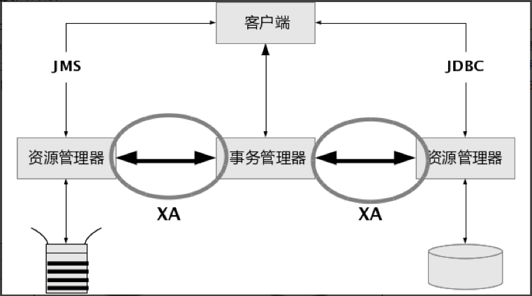

## 2022年IT架构人才培养结业考试-卷2-笔记

### 1.SOA架构：

#### 1.1什么是SOA架构

SOA（全称：Service Oriented Architecture），中文意思为 “面向服务的架构”，你可以将它理解为一个架构模型或者一种设计方法，而并不是服务解决方案。其中包含多个服务， 服务之间通过相互依赖或者通过通信机制，来完成相互通信的，最终提供一系列的功能。一个服务通常以独立的形式存在与操作系统进程中。各个服务之间通过网络调用 。

跟 SOA 相提并论的还有一个 ESB（企业服务总线），简单来说ESB就是一根管道，用来连接各个服务节点。为了集成不同系统，不同协议的服务，ESB 可以简单理解为：它做了消息的转化解释和路由工作，让不同的服务互联互通；

我们将各个应用之间彼此的通信全部去掉，在中间引入一个ESB企业总线，各个服务之间，只需要和ESB进行通信，这个时候，各个应用之间的交互就会变得更加的清晰，业务架构/逻辑等，也会变得很清楚。原本杂乱没有规划的系统，梳理成了一个有规划可治理的系统，在这个过程中，最大的变化，就是引入了ESB企业总线。

###### 1.3.1.1简单对象访问协议（SOAP）

**SOAP**（原为**Simple Object Access Protocol**的[首字母缩写](https://zh.m.wikipedia.org/wiki/首字母缩写)，即**简单对象访问协议**）是交换数据的一种协议规范，使用在电脑网络[Web服务](https://zh.m.wikipedia.org/wiki/Web服务)（web service）中，交换带结构的信息。SOAP为了简化网页服务器（Web Server）从[XML](https://zh.m.wikipedia.org/wiki/XML)数据库中提取数据时，节省去格式化页面时间，以及不同应用程序之间按照[HTTP](https://zh.m.wikipedia.org/wiki/HTTP)通信协议，遵从[XML](https://zh.m.wikipedia.org/wiki/XML)格式执行资料互换，使其抽象于语言实现、平台和硬件。此标准由[IBM](https://zh.m.wikipedia.org/wiki/IBM)、[Microsoft](https://zh.m.wikipedia.org/wiki/Microsoft)、[UserLand](https://zh.m.wikipedia.org/w/index.php?title=UserLand&action=edit&redlink=1)和[DevelopMentor](https://zh.m.wikipedia.org/w/index.php?title=DevelopMentor&action=edit&redlink=1)在1998年共同提出，并得到IBM、莲花（Lotus）、康柏（Compaq）等公司的支持，于2000年提交给[万维网联盟](https://zh.m.wikipedia.org/wiki/万维网联盟)（[World Wide Web Consortium](https://zh.m.wikipedia.org/wiki/World_Wide_Web_Consortium)，W3C），目前SOAP 1.1版是业界共同的标准，属于第二代的XML协议（第一代具主要代表性的技术为XML-RPC以及WDDX）。

用一个简单的例子来说明SOAP使用过程，一个SOAP消息可以发送到一个具有Web Service功能的Web站点，例如，一个含有房价信息的数据库，消息的参数中标明这是一个查询消息，此站点将返回一个XML格式的信息，其中包含了查询结果（价格，位置，特点，或者其他信息）。由于数据是用一种标准化的可分析的结构来传递的，所以可以直接被第三方站点所利用。

###### 1.3.1.2Apache Thrift

Thrift是一个轻量级、跨语言的远程服务调用框架，最初由Facebook开发，后面进入Apache开源项目。它通过自身的IDL中间语言, 并借助代码生成引擎生成各种主流语言的RPC服务端/客户端模板代码。

Thrift支持多种不同的编程语言，包括C++、Java、Python、PHP、Ruby等，本系列主要讲述基于Java语言的Thrift的配置方式和具体使用。

###### 1.3.1.3 Apache ActiveMQ

Apache ActiveMQ 是 Apache 软件基金会所研发的开放源代码消息[中间件](https://cloud.tencent.com/product/tdmq?from=10680)；由于 ActiveMQ 是一个纯 Java 程序，因此只需要操作系统支持 Java 虚拟机，ActiveMQ 便可执行。ActiveMQ 是一个完全支持 JMS1.1 和 J2EE 1.4 规范的 JMS Provider 实现。

Apache下的一个子项目。使用Java完全支持JMS1.1和J2EE 1.4规范的 JMS Provider实现，少量代码就可以高效地实现高级应用场景。可插拔的传输协议支持，比如：in-VM, TCP, SSL, NIO, UDP, multicast, JGroups and JXTA transports。ActiveMQ支持常用的多种语言客户端 C++、Java、.Net,、Python、 Php、 Ruby等。

###### 1.3.1.4 Java Message Service（JMS）

JMS(Java Messaging Service) 是 Java 平台上有关面向消息中间件的技术规范，它便于消息系统中的 Java 应用程序进行消息交换,并且通过提供标准的产生、发送、接收消息的接口简化企业应用的开发。JMS 本身只定义了一系列的接口规范，是一种与厂商无关的 API，用来访问消息收发系统。

JMS 能够通过消息收发服务(有时称为消息中介程序或路由器)从一个 JMS 客户机向另一个 JMS 客户机发送消息。消息是 JMS 中的一种类型对象，由两部分组成：报头和消息主体。报头由路由信息以及有关该消息的元数据组成。消息主体则携带着应用程序的数据或有效负载。JMS 定义了五种不同的消息正文格式，以及调用的消息类型，允许你发送并接收以一些不同形式的数据，提供现有消息格式的一些级别的兼容性。 

♞ `TextMessage`：个字符串对象 

♞ `MapMessage`：套名称 - 值对  

♞ `ObjectMessage`：个序列化的 Java 对象  

♞ `BytesMessage`：个字节的数据流  

♞ `StreamMessage`：Java 原始值的数据流

**☞ 点对点**

  当一个消息生产者产生一个消息时，会把消息放入一个队列(Queue)中，然后消息消费者从 Queue 中读取消息，如果同时有多个消费者读取消息，ActiveMq 保证消息只会被一个消费者读取到，消费者读取到消息之后需要向 ActiveMq 发送一条确认信息，确认消息已经被接收，此时，队列(Queue)中的消息出队，整个流程就处理完了。

**☞ 发布/订阅**

  发布/订阅模式允许一条消息可以被多个订阅了该 Topic 的消息消费者接收，当一个消息生产者产生一个消息时，会把消息放入一个 Topic 中，然后监听在此 Topic 上的消息消费者都能接收到消息。

##### 1.3.2主流MQ消息队列比较（ActiveMQ vs Kafka vs RocketMQ vs RabbitMQ）

#### 1.4面向服务的架构中的 ESB 是什么？

企业服务总线（ESB）是在与具有多个服务的系统进行通信时可以使用的软件。无论使用的是什么技术，它都可以在服务和服务使用者之间建立通信。 

##### ESB 的优势

ESB 通过可重用的服务接口提供通信和转换功能。您可以将 ESB 视作将服务请求路由至适当服务的集中式服务。它还会将请求转换为服务的基础平台和编程语言可接受的格式。

### 2.什么是 WAF？| Web Application Firewall 解读

WAF（Web 应用程序[防火墙](https://www.cloudflare.com/learning/security/what-is-a-firewall/)）通过过滤和监控 Web 应用程序与互联网之间的 [HTTP](https://www.cloudflare.com/learning/ddos/glossary/hypertext-transfer-protocol-http/) 流量来帮助保护 Web 应用程序。它通常可以保护 Web 应用程序，使其免受[跨站点伪造](https://www.cloudflare.com/learning/security/threats/cross-site-request-forgery/)、[跨站点脚本 (XSS)](https://www.cloudflare.com/learning/security/threats/cross-site-scripting/)、文件包含、[SQL 注入](https://www.cloudflare.com/learning/security/threats/sql-injection/)及其他一些攻击的影响。WAF 属于协议[第 7 层](https://www.cloudflare.com/learning/ddos/what-is-layer-7/)防御策略（[OSI 模型](https://www.cloudflare.com/learning/ddos/glossary/open-systems-interconnection-model-osi/)中），并不能抵御所有类型的攻击。此攻击缓解方法通常隶属于一套工具，整套工具共同针对一系列攻击手段建立整体防御措施。

通过在 Web 应用程序前端部署 WAF，可在 Web 应用程序与 Internet 之间形成一道屏障。虽然代理服务器通过中介保护客户机的身份，但 WAF 是一种[反向代理](https://www.cloudflare.com/learning/cdn/glossary/reverse-proxy/)，引导客户端通过 WAF 到达服务器，从而防止暴露服务器。

WAF 通过一组通常称为“政策”的规则进行运作。这些政策旨在过滤恶意流量，防止受到应用程序漏洞的侵害。WAF 的部分价值在于可以快速简便地修改政策，因而可以更迅速地响应不同的攻击手段。在 [DDoS 攻击](https://www.cloudflare.com/learning/ddos/what-is-a-ddos-attack)期间，可通过修改 WAF 政策快速实施速率限制。

### 3.XA协议

XA是一个分布式事务协议，由Tuxedo提出。XA中大致分为两部分：事务管理器和本地资源管理器。其中本地资源管理器往往由数据库实现，比如Oracle、DB2这些商业数据库都实现了XA接口，而事务管理器作为全局的调度者，负责各个本地资源的提交和回滚。

#### 3.1 XA实现分布式事务的原理如下：

#### 3.2 XA接口详解

X/Open XA接口是双向的系统接口，在事务管理器（Transaction Manager）以及一个或多个资源管理器（Resource Manager）之间形成通信桥梁。事务管理器控制着JTA事务，管理事务生命周期，并协调资源。在JTA中，事务管理器抽象为javax.transaction.TransactionManager接口，并通过底层事务服务（即JTS）实现。资源管理器负责控制和管理实际资源（如数据库或JMS队列）。下图说明了事务管理器、资源管理器，以及典型JTA环境中客户端应用之间的关系：

注意，上图中XA接口形成了事务管理器和资源管理器之间的通信桥梁。因为XA接口的双向特质，XA支持两阶段提交协议。

### 4.SAN、NAS、DAS是什么东西？它们之间有什么关联？

#### 4.1 SAN

存储区域网络 (Storage Area Network, SAN) 是企业最常用的存储网络架构，要求高吞吐量和低延迟的[业务关键型应用](https://www.netapp.com/zh-hans/enterprise-applications)往往采用这类架构运行。如今，采用[全闪存存储](https://www.netapp.com/zh-hans/data-storage/what-is-flash-storage)的 SAN 部署数量增速迅猛。与旋转磁盘相比，全闪存存储可提供更出色的性能、稳定一致的低延迟以及更低的总成本。SAN 将数据存储在集中式共享存储中，使企业能够运用一致的方法和工具来实施安全防护、[数据保护](https://www.netapp.com/zh-hans/cyber-resilience/data-protection)和[灾难恢复](https://www.netapp.com/zh-hans/cyber-resilience/data-protection/disaster-recovery)。

SAN 是一种基于块的存储，利用高速架构将服务器与其逻辑磁盘单元 (Logical Disk Unit, LUN) 相连。LUN 是一系列通过共享存储池配置的块，以逻辑磁盘的形式呈现给服务器。服务器会对这些块进行分区和格式化，通常使用文件系统，以便可以像在本地磁盘存储上一样在 LUN 上存储数据。

##### 4.1.1 SAN 协议

- 光纤通道协议 (FCP)Internet 
- 小型计算机系统接口 (iSCSI)
- 以太网光纤通道 (FCoE)
- 基于光纤通道的非易失性内存标准 (FC-NVMe)

#### 4.2 NAS

NAS（Network Attached Storage：网络附属存储）按字面简单说就是连接在网络上，具备资料存储功能的装置，因此也称为“[网络存储器](https://baike.baidu.com/item/网络存储器/9485387?fromModule=lemma_inlink)”。它是一种专用数据[存储服务器](https://baike.baidu.com/item/存储服务器?fromModule=lemma_inlink)。它以数据为中心，将存储设备与服务器彻底分离，集中管理数据，从而释放带宽、提高性能、降低总拥有成本、保护投资。其成本远远低于使用服务器存储，而效率却远远高于后者。国际著名的NAS企业有Netapp、EMC、OUO等。

##### 4.2.1 NAS 协议

- **公共 Internet 文件服务/服务器消息块 (Common Internet File Services / Server Message Block, CIFS/SMB)。**这是 Windows 通常使用的协议。
- **网络文件系统 (NFS)。**NFS 最早为 UNIX 服务器而开发，也是通用的 Linux 协议。

NAS 被定义为一种特殊的专用数据存储服务器，包括存储器件（例如磁盘阵列、CD/DVD驱动器、磁带驱动器或可移动的存储介质）和内嵌系统软件，可提供跨平台文件共享功能。NAS通常在一个LAN上占有自己的节点，无需应用服务器的干预，允许用户在网络上存取数据，在这种配置中，NAS集中管理和处理网络上的所有数据，将负载从应用或企业服务器上卸载下来，有效降低总拥有成本，保护用户投资，NAS本身能够支持多种协议（如NFS、CIFS、FTP、HTTP等），而且能够支持各种操作系统。

#### 4.3 DAS

开放系统的直连式存储(Direct-Attached Storage，简称DAS)已经有近四十年的使用历史，随着用户数据的不断增长，尤其是数百GB以上时，其在备份、恢复、扩展、灾备等方面的问题变得日益困扰系统管理员，直连式存储与服务器主机之间的连接通道通常采用SCSI连接，随着服务器CPU的处理能力越来越强，存储硬盘空间越来越大，阵列的硬盘数量越来越多，SCSI通道将会成为IO瓶颈;服务器主机SCSI ID资源有限，能够建立的SCSI通道连接有限。

#### 4.4 SAN和NAS的区别：

san是一种网络，NAS产品是一个专有文件服务器或一个只能文件访问设备。

SAN是在服务器和存储器之间用作I/O路径的专用网络。

SAN包括面向块（SCIS）和面向文件（NAS）的存储产品。

### 5.CNAME记录

**真实名称记录**（英语：Canonical Name Record），即**CNAME记录**，是域名系统（[DNS](https://zh.m.wikipedia.org/wiki/DNS)）的一种记录。CNAME记录用于将一个[域名](https://zh.m.wikipedia.org/wiki/域名)（同名）映射到另一个域名（真实名称），[域名解析服务器](https://zh.m.wikipedia.org/wiki/域名解析服务器)遇到CNAME记录会以映射到的目标重新开始查询。[[1\]](https://zh.m.wikipedia.org/zh-sg/CNAME记录#cite_note-1)

这对于需要在同一个IP地址上运行多个服务的情况来说非常方便。若要同时运行[文件传输](https://zh.m.wikipedia.org/wiki/文件传输协议)服务和[Web服务](https://zh.m.wikipedia.org/wiki/Web服务)，则可以把*ftp.example.com*和*www.example.com*都指向DNS记录*example.com*，而后者则有一个指向IP地址的A记录。如此一来，若服务器IP地址改变，则只需修改*example.com*的A记录即可。

CNAME记录必须指向另一个域名，而不能是IP地址。

#### 5.1设置CNAME域名解析

CNAME域名解析即别名记录，当您需要将域名指向另一个域名，再由另一个域名提供IP地址时，就需要添加CNAME记录。阿里云应用型负载均衡ALB支持将您拥有的常用域名通过CNAME方式解析到ALB实例的公网服务域名上，使您可以更加方便地访问各种网络资源。

##### 5.1.1 ALB相关的域名解析方式简介

最常见的两种域名解析方式为A记录域名解析和CNAME域名解析。ALB对外提供域名，只支持CNAME域名解析。

- **A记录域名解析**

  A记录域名解析又称IP指向，您可以设置子域名并指向到自己的目标主机IP上，从而实现通过域名找到指定IP。应用型负载均衡ALB默认对外提供公网IP访问，如需通过域名访问主机，可以配置A记录域名解析，具体实现方案如下图所示：

- **CNAME域名解析**

  CNAME域名解析又称别名解析，您可以设置子域名并指向到其他域名，从而实现将一个域名指向另一个域名。应用型负载均衡ALB默认对外提供域名访问，如果通过其他域名访问请配置CNAME域名解析，具体实现方案如下图所示：

### 6.全局负载均衡工作原理及实现

#### 6.1. 全局负载均衡在 CDN 系统中的作用

- CDN 系统总是希望使用距离用户最近的设备为用户提供服务，这样就需要在全网不同位置部署多个节点。CDN 全局负载均衡系统GSLB就是为了解决节点之间相互协同的问题，实现整个系统的大规模服务能力和高可用性。
- GSLB 主要是在多个节点之间进行均衡，其结果可能直接终结负载均衡的过程，也可能将用户访问交付给下一层次的负载均衡系统
- 在区域或者本地的负载均衡系统中，每个服务节点只掌握本节点内服务设备的信息，而在 GSLB 系统中，需要掌握所有节点中的信息

#### 6.2 基于DNS解析的GSLB实现机制

**DNS解析：**

DNS 记录类型及报文格式：

1. A 记录， Address。描述了域名到IP地址的映射关系，对于同一个域名，可以存在多条映射记录
2. NS 记录 Name Server。域名服务器记录，用于指定域名由哪个DNS服务器来进行解析的。
3. SOA 记录 Start Of Authority。记录指定该区域的权威域名服务器。
4. CNAME。记录别名于域名的对应关系，这种记录允许将多个名字映射到同一台计算机上
5. PTR 记录， Point Record。记录用于描述 IP 地址到域名的映射关系。

#### 6.2 通过CNAME方式实现负载均衡

- CNAME 描述了一个域名或主机名的别名，域名服务器获取到 CNAME 记录后，会用记录中的别名来替换查找的域名或者主机名。
- 实现上利用了 DNS 本身的别名机制和轮训机制。
- 先将 GSLB 主机名定义为所查询域名的权威 DNS服务器的别名，然后在 GSLB 主机名添加多条 A 记录，分别对应多个服务器的 IP 地址。这样，本地 DNS 服务器会向客户端返回多个IP地址作为查询结果，并且这些IP地址的排列顺序是轮换的

### 7.关于Hypervisor的理解

**Hypervisor**，又称**虚拟机监视器**（英语：virtual machine monitor，缩写为 VMM），是用来建立与执行[虚拟机器](https://baike.baidu.com/item/虚拟机器?fromModule=lemma_inlink)的软件、固件或硬件。

被Hypervisor用来执行一个或多个虚拟机器的电脑称为主体机器（host machine），这些虚拟机器则称为客体机器（guest machine）。hypervisor提供虚拟的作业平台来执行客体操作系统（guest operating systems），负责管理其他客体操作系统的执行阶段；这些客体操作系统，共同分享虚拟化后的硬件[资源](https://baike.baidu.com/item/资源?fromModule=lemma_inlink)。

#### 7.1 Hypervisor是什么?

Hypervisor一种运行在基础物理服务器和操作系统之间的中间软件层，可允许多个操作系统和应用共享硬件。也可叫做VMM( virtual machine monitor )，即虚拟机监视器。

Hypervisor是一种在虚拟环境中的“元”操作系统。他们可以访问服务器上包括磁盘和内存在内的所有物理设备。Hypervisor不但协调着这些硬件资源的访问，也同时在各个虚拟机之间施加防护。当服务器启动并执行Hypervisor时，它会加载所有虚拟机客户端的操作系统同时会分配给每一台虚拟机适量的内存，CPU，网络和磁盘。

一个hypervisor（又被称为virtual machine monitor，VMM，或virtualizer）是一种模拟器；它是创建或者运行虚拟机的软件、固件、或者硬件。一个计算机，上面运行着一个hypervisor，hypervisor上面又运行着一个或多个虚拟机，该计算机被称为host machine，每一个虚拟机被叫做guest machine。hypervisor为guest operating system营造了一个虚拟的操作系统，并且对guest operating system的运行进行管理。多个不同的操作系统能够共享虚拟化的硬件资源：例如，Linux，Windows，macOS实例能够在一个单独的物理x86机器上运行。这与操作系统级虚拟化技术不同，该技术让所有的实例共享一个内核（所谓操作系统级虚拟化技术就是指容器），即使guest operating system能够在user space不同，例如有同样的内核的Linux distribution。

### 8.OpenStack

Openstack可以说是一个社区（社区官网：http://www.openstack.org/，国内对openstack报道网站：[http://www.openstack.cn](http://www.openstack.cn/)），包括开源的代码（源代码网址：https://github.com/openstack）、多个组件的项目开发等内容；是一个美国国家航空航天局和Rackspace合作研发的，以Apache许可证授权，并且是一个自由软件和开放源代码项目。OpenStack是一个云平台管理的项目，它决不是一个单纯软件。Openstack随着组件的增加，功能日益丰富；其版本号现在到了H版，I版马上也要Release。Openstack的版本号和发布一个软件产品一样，只是随着功能的增加和完善用版本号作为一个个里程碑来区分下。

#### 8.1 openstack组件关系图

Openstack为了实现云计算的各项功能，将计算、存储和网络划分了几个项目分别来开发,每个项目对应着Openstack的一个或几个组件；Openstack的组件及关系有以下几个（下面资料来自openstack官网，仅是翻译下）：

其中主要组件的作用：

- Horizon：为openstack提供交互页面;
- Nova：负责虚拟机的生命周期管理，及部分网络，主要是虚拟机相关的;
- Neutron: 负责虚拟环境下的网络；在G版中称为quantum组件，因已经被注册到H版改名；
- Swift：对象存储；
- Cinder：块存储；
- Keystone：负责整个openstack各个组件和服务之间的安全认证机制方面的工作；

#### 8.2 Openstack的网络的neutron组件

Neutron为openstack的虚拟机提供网络方面的功能；原来没有neutron这个组件（G版名称是Quantum）的时候，网络的主要功能也是在nova组件里实现的，那时候底层采用的大多是linux bridge，无法实现灵活组网和高级的网络功能；为此Openstack把网络大部分功能转到了neutron组件来开发实现，但是nova里还有些网络功能被保留，比如虚拟机的网卡方面的功能。其实，Openstack里网络功能是最复杂的功能，很多计算和存储方面的问题都是和网络紧密相关的。连Openstack的官网也说配置neutron是Openstack里最让人感觉繁琐的事情之一。

相对于交换机整个系统来说，Neutron其实是系统平台的位置，提供配置命令及参数检查，并把网络功能用一种逻辑组织起来；但是无论底层的plugin最终是用软件SDN还是硬件交换机来加速，Neutron自身并不提供任何网络功能，它只是一个架子。Neutron的网络功能大部分是Plugin提供的，除了DHCP和L3-agent等的某些部分功能。

**Neutron将网络按照三层交换机的概念分为：**

- Network：相当于交换机根据vlan创建的一个三层接口；
- Subnet：相当于交换机创建了一个三层接口地址；
- Port：相当于交换机的一个物理端口，但是这个端口有一个MAC地址；

### 9.PKI 体系的组成

PKI 利用公钥技术和数字证书建立一个安全域，在此环境内，PKI 主要负责管理加密密钥，其中包括密钥的更新、恢复；负责发布数字证书，包括证书的生成、更新和撤销等。如果 PKI 体系有需求与其他安全域建立互联的信任关系，可以通过交叉认证等形式建立联系。

PKI 将硬件系统、软件系统及安全策略结合形成一个完整的安全机制，无论发送方在什么地点什么身份，都以证书为最根本的信任依据，在此基础上双方进行各种通讯活动。

PKI 系统由认证机构 CA、注册机构 RA、数字证书库、密钥备份及恢复系统、证书撤销系统、密钥更新机制等组成。

- **认证机构 CA：**它是数字证书的颁布机关，也是 PKI 体系的核心，是具有权威性、公正性的第三方机构。认证机构 CA 首先确认申请证书的申请用户身份，然后将要颁发的证书的主体与公钥捆绑在一起，生成数字证书，从而使申请用户与一对公钥和私钥建立对应关系。
- **注册机构 RA：**它负用来收用户的申请，审核用户的真实身份，符合颁发证书条件的用户可以被颁布数字证书，否则将不能获得数字证书。
- **数字证书库：**集中储存已经颁发的证书和公钥，用户可以方便地在证书库中查询其他证书等相关信息。数字证书库的存放方式为目录服务器、关系数据库等。通常用的是 LDAP 目录。

### 10. 什么是软件定义网络？（SDN）

#### 10.1 概述

软件定义网络（SDN）是一种将网络资源抽象到虚拟化系统中的 [IT 基础架构](https://www.redhat.com/zh/topics/cloud-computing/what-is-it-infrastructure)方法。SDN 将网络转发功能与网络控制功能分开，其目标是创建可集中管理和可编程的网络。SDN 允许 IT 运维团队通过集中化面板来控制复杂网络拓扑中的网络流量，而无需手动处理每个网络设备。

#### 10.2 软件定义网络的优势

企业采用软件定义网络通常是为了对付传统基础架构的限制。软件定义网络的优势包括：

- **降低成本** - 软件定义网络基础架构通常要比相应的硬件便宜，因为它们是在现成的商用服务器上运行，而不是在昂贵的单用途设备上运行。由于可以在单个服务器上运行多个功能，因此它们占用的空间也较少。这就意味着需要的物理硬件更少，故而更利于资源整合，以降低物理空间占用、功耗和总体成本。 
- **提高可扩展性和灵活性** - 通过[虚拟化](https://www.redhat.com/zh/topics/virtualization/what-is-virtualization)网络基础架构，您可以在合适的情况下根据需要扩展或收缩网络资源，而不必大费周折地添加其他专有硬件。采用软件定义网络会为您带来极大的灵活性，可实现网络资源的自助置备。
- **简化管理** - 软件定义网络使整个[基础架构](https://www.redhat.com/zh/topics/cloud-computing/what-is-it-infrastructure)更容易操作，因为无需极其专业的网络专家来管理。 

在与[软件定义存储](https://www.redhat.com/zh/topics/data-storage/software-defined-storage)和其他技术相结合的情况下，软件定义网络可以构建一种称为[超融合](https://www.redhat.com/zh/topics/hyperconverged-infrastructure/what-is-hyperconverged-infrastructure)的 IT 基础架构：一种几乎万能的软件定义方法。

#### 10.3 软件定义网络（SDN）与网络功能虚拟化（NFV）

对于[电信](https://www.redhat.com/zh/solutions/telecommunications)公司来说，还有另一种网络抽象，称为[网络功能虚拟化](https://www.redhat.com/zh/topics/virtualization/what-is-nfv)（NFV）。与软件定义网络类似，NFV 将从硬件中抽象网络功能。NFV 通过提供可运行 SDN 软件的基础架构来支持软件定义网络。NFV 使提供商可以灵活地在不同服务器上运行相应的功能，或在需求发生变化时根据需要移动这些功能。这种灵活性可以让电信服务提供商更快交付服务和应用。例如，如果客户请求一项新的网络功能，那么他们可以启动新的[虚拟机](https://www.redhat.com/zh/topics/virtualization/what-is-a-virtual-machine)（VM）来处理该请求。当不再需要该功能时，可停用此虚拟机。这是一种低风险测试潜在新服务价值的方法。

根据您要完成的工作，NFV 和 SDN 可以协同使用，两者都使用商用硬件。借助 NFV 和 SDN，您可以打造一个更加灵活、可编程且可以有效利用资源的网络架构。

### 11.领域驱动设计

> **领域驱动设计(DDD)** 是一种通过将实现连接到持续进化的模型来满足复杂需求的软件开发方法. 领域驱动设计的前提是:
>
> - 把项目的主要重点放在核心领域和领域逻辑上
> - 把复杂的设计放在领域模型上
> - 发起技术专家和领域专家之间的创造性协作,以迭代方式完善解决特定领域问题的概念模型

#### 11.1分层

ABP框架遵循DDD原则和模式去实现分层应用程序模型,该模型由四个基本层组成:

- **表示层**: 为用户提供接口. 使用*应用层*实现与用户交互.
- **应用层**: 表示层与领域层的中介,编排业务对象执行特定的应用程序任务. 使用应用程序逻辑实现用例.
- **领域层**: 包含业务对象以及业务规则. 是应用程序的核心.
- **基础设施层**: 提供通用的技术功能,支持更高的层,主要使用第三方类库.

#### 11.2 洋葱架构针对六边形架构

更进⼀步把内层的业务逻辑分为了DDD概念的应⽤服务层、领域服务层和领域模型层。

特点：

（1）围绕独⽴的领域模型构建应⽤

（2）内层定义接⼝，外层实现接⼝

（3）依赖的⽅向指向圆⼼（注意：洋葱架构提倡不破坏耦合⽅向的依赖都是合理的，外层可以依赖直接内层，也可以依赖更⾥⾯的层）

（4）所有的应⽤代码可以独⽴于基础设施编译和运⾏

#### 11.3 总结

目前领域驱动设计是目前比较流行的一种架构设计，只需要按照领域驱动设计的四重边界进行架构设计，就能够很好的对各个领域解耦，对后期的业务垂直扩展、功能的水平扩展提供了良好的基础。[更多材料](https://blog.csdn.net/qianshangding0708/article/details/123813379)

### 12.CAP 的定义

所谓的分布式系统，说白了就是一件事一个人做的，现在分给好几个人一起干。我们先简单回顾下 CAP 各个维度的含义：

-  **Consistency（一致性）**，这个理解起来很简单，就是每时每刻每个节点上的同一份数据都是一致的。这就要求任何更新都是原子的，即要么全部成功，要么全部失败。想象一下使用分布式事务来保证所有系统的原子性是多么低效的一个操作。
-  **Availability（可用性）**， 这个可用性看起来很容易理解，但真正说清楚的不多。我更愿意把可用性解释为：任意时刻系统都可以提供读写服务。举个例子，当我们用事务将所有节点锁住来进行某种写操作时，如果某个节点发生不可用的情况，会让整个系统不可用。对于分片式的 NoSQL 中间件集群（Redis，Memcached）来说，一旦一个分片歇菜了，整个系统的数据也就不完整了，读取宕机分片的数据就会没响应，也就是不可用了。需要说明一点，哪些选择 CP 的分布式系统，并不是代表可用性就完全没有了，只是可用性没有保障了。为了增加可用性保障，这类中间件往往都提供了“分片集群+复制集”的方案。
-  **Partition tolerance（分区容忍性）**， 这个可能也是很多文章都没说清楚的。P 并不是像 CA 一样是一个独立的性质，它依托于 CA 来进行讨论。参考文献中的解释：“除非整个网络瘫痪，否则任何时刻系统都能正常工作”，言下之意是小范围的网络瘫痪，节点宕机，都不会影响整个系统的 CA。我感觉这个解释听着还是有点懵逼，所以个人更愿意解释为当节点之间网络不通时（出现网络分区），可用性和一致性仍然能得到保障。从个人角度理解，分区容忍性又分为“可用性分区容忍性”和“一致性分区容忍性”。出现分区时会不会影响可用性的关键在于需不需要所有节点互相沟通协作来完成一次事务，不需要的话是铁定不影响可用性的。庆幸的是应该不太会有分布式系统会被设计成完成一次事务需要所有节点联动，一定要举个例子的话，全同步复制技术下的 MySQL 是一个典型案例。出现分区时会不会影响一致性的关键则在于出现脑裂时有没有保证一致性的方案，这对主从同步型数据库（MySQL、SQL Server）是致命的。一旦网络出现分区，产生脑裂，系统会出现一份数据两个值的状态，谁都不觉得自己是错的。需要说明的是，正常来说同一局域网内，网络分区的概率非常低，这也是为啥我们最熟悉的数据库（MySQL、SQL Server 等）也是不考虑 P 的原因。

#### 12.1 CAP 之间的经典关系图

